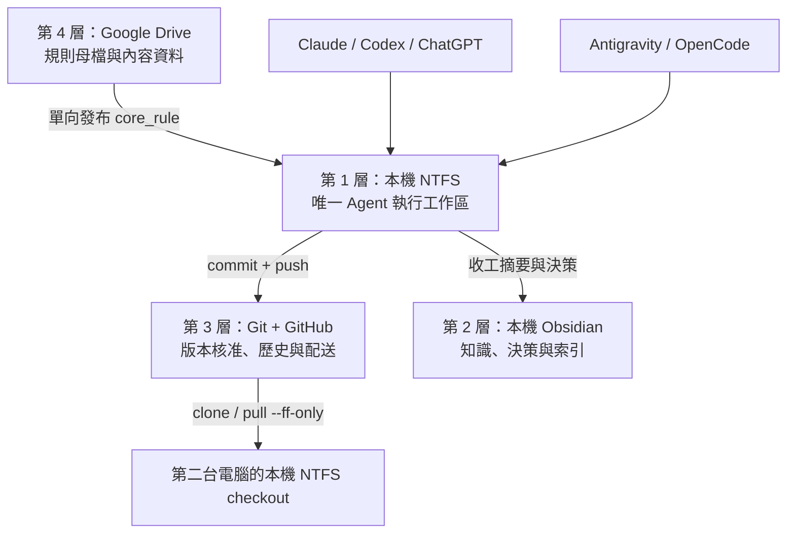
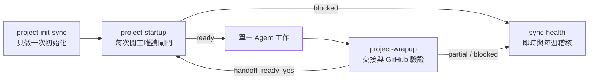
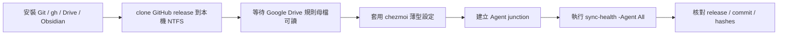

# 跨電腦、跨 AI Agent 共生架構完整指南

> 適用對象：需要在多台 Windows 電腦，以及 ChatGPT、Codex、Claude、Antigravity、OpenCode 等不同 AI Agent 之間接力工作的人。
> 核心原則：每一類資料只能有一個可編輯權威來源；Agent 只在本機 NTFS 執行；GitHub 負責核准版本與跨電腦配送；Google Drive 與 Obsidian 不取代 Git。

---

## 1. 架構目標

這套架構要解決四個常見問題：

1. 同一專案在兩台電腦各自修改，最後不知道哪一份才是最新版。
2. Claude、Codex、ChatGPT、Antigravity、OpenCode 各自保存一套規則或 Skills，逐漸產生內容分岔。
3. 把 Git repo 放在 Google Drive 後，雲端同步、Git 操作與檔案鎖互相干擾。
4. 前一個 Agent 沒有完成 commit、push 與交接，下一個 Agent 就從舊資料開始修改。

完成部署後，應達成：

- 所有 Agent 只在本機 NTFS 工作區執行。
- 每台電腦從同一個 GitHub commit 取得正式版本。
- 前一個 Agent 必須完成 `HANDOFF.md`、commit、push 與遠端驗證，下一個 Agent 才能開始。
- Google Drive 保存指定的規則母檔與內容資料，不承擔 Git 執行工作區。
- Obsidian 保存決策脈絡、索引與長期知識，不成為程式碼或專案狀態的第二套 SSOT。
- 所有 Agent 共用同一套四個核心 Skills。
- 每週自動執行唯讀稽核，發現分岔時回傳失敗，不自動覆蓋資料。

---

## 2. 最重要的觀念：不是一個總 SSOT，而是分類 SSOT

不同資料類型應由不同系統負責。錯誤做法是要求 Google Drive、Obsidian、GitHub 和本機資料夾同時保存並雙向修改所有檔案。

| 資料類型 | 唯一可編輯權威 | 其他位置的角色 |
|---|---|---|
| 專案程式、文件、四個 canonical files | 本機 NTFS 工作副本，完成後以 GitHub commit 核准 | 其他電腦只從 GitHub取得 |
| 正式版本與歷史 | GitHub repo | 本機 Git 保存工作歷史與待推送 commit |
| 全域 AI 規則內容 | Google Drive 的 `core_rule.md` | 發布後產生本機 `core_rule.md`、`CLAUDE.md`、`AGENTS.md`，再提交 GitHub |
| 共用 Skills | GitHub release | 各電腦在本機 NTFS checkout 執行，Agent 只建立薄型 junction |
| 長期知識、決策理由、會議紀錄 | Obsidian vault | 專案只保存連結或摘要，不複製整份知識庫 |
| 大型原始文件、影音、參考資料 | Google Drive | 專案保存路徑、索引或經核准的必要副本 |
| Token、登入狀態、session、cache | 只存在各電腦安全儲存區 | 禁止進入 Git、Google Drive 規則資料夾或 Obsidian 公開筆記 |
| 健檢 log | 本機且 Git ignored | 只供診斷，不作為正式專案資料 |

只要同一個檔案允許在兩個位置獨立編輯，就仍然可能分岔。

---

## 3. 四層架構定位



### 3.1 第 1 層：本機 NTFS Execution Layer

**定位：唯一執行與編輯位置。**

建議路徑：

```text
C:\Users\<user>\Documents\AI-Workspace
```

這一層保存：

- Git working tree。
- 專案檔案與程式碼。
- `PROJECT.md`、`HANDOFF.md`、`AGENTS.md`、`CLAUDE.md`。
- 經發布的 `core_rule.md` 本機鏡像。
- 正式共用 Skills。
- 架構 manifest、部署腳本、唯讀健檢腳本。

規則：

- Agent 只能在這一層修改或執行專案。
- 工作區不可位於 Google Drive、OneDrive 或其他即時雲端同步資料夾。
- 一台電腦上的不同 Agent 共用同一個本機 checkout。
- 不同電腦各自有一個 checkout，透過 GitHub 接力，不直接同步 working tree。
- 本機有未提交內容時，不得假設另一台電腦已取得這些內容。

### 3.2 第 2 層：本機 Obsidian Knowledge Layer

**定位：第二大腦、決策脈絡與知識索引。**

建議路徑：

```text
C:\Users\<user>\Documents\ObsidianVault
```

若使用 Google Drive Desktop 同步 vault，也可以放在 Google Drive 掛載路徑，但只能選一個同步機制，不要同時用 Git、Obsidian Sync 和 Google Drive 雙向同步同一個 vault。

適合保存：

- 專案索引。
- 會議紀錄。
- 決策理由。
- 研究筆記。
- 失敗經驗、踩坑與長期可重用知識。
- 指向 GitHub repo、`PROJECT.md` 和 `HANDOFF.md` 的連結。

不適合保存：

- 尚未 commit 的唯一程式碼。
- 下一個 Agent 必須依賴的最新工作狀態。
- Git branch 與 remote HEAD 的替代紀錄。
- Token、登入憑證、session 或 cache。

Obsidian 更新成功，不代表 GitHub 已推送；GitHub 推送成功，也不代表 Obsidian 已更新。收工時必須分別回報。

### 3.3 第 3 層：Git + GitHub Version Layer

**定位：版本核准、歷史、復原與跨電腦配送。**

Git 與 GitHub 的責任不同：

| 元件 | 責任 |
|---|---|
| 本機 Git | 建立 commit、檢查 diff、保存本次修改歷史 |
| GitHub repo | 保存核准版本、供其他電腦 clone/pull、驗證 remote HEAD |
| Release tag | 識別共同架構版本，確保不同 Agent 部署相同內容 |

GitHub 是跨電腦接力的正式依據。聊天摘要、Google Drive 修改時間與 Obsidian 筆記都不能取代 Git commit。

必要規則：

- 開工前必須查詢 GitHub 最新 HEAD。
- 只有 `local HEAD == remote HEAD` 才可直接開始修改。
- 本機落後時只允許經確認後執行 fast-forward。
- 本機超前、分岔或遠端無法驗證時停止修改。
- 禁止 Agent 自動 rebase、merge、force push 或 destructive reset。
- push 後必須重新查詢 remote HEAD，不能只相信 `git push` 顯示成功。

### 3.4 第 4 層：Google Drive Content Source Layer

**定位：規則內容母檔、大型參考資料與跨裝置內容同步。**

建議結構：

```text
G:\AI-SSOT\
├─ core_rule.md
├─ source-documents\
├─ reference-data\
└─ archive\
```

Google Drive 可以作為 `core_rule.md` 的唯一可編輯母檔，但不能直接作為 Agent runtime：

```text
Google Drive core_rule.md
        ↓ 單向發布
本機 NTFS core_rule.md
        ↓ 產生核心規則區塊
本機 CLAUDE.md / AGENTS.md
        ↓ commit + push
GitHub 核准版本
```

禁止事項：

- 不在 Google Drive 內建立新的 Git working repo。
- 不讓 Agent 的 Skills junction 指向 Google Drive。
- 不直接修改 Google Drive 的 `CLAUDE.md` 或 `AGENTS.md` 作為另一套規則來源。
- 不把 Google Drive 衝突副本視為正式版本。
- 不用 Google Drive 同步完成圖示代替 GitHub remote verification。

---

## 4. 標準目錄結構

以下範例可依個人帳號與磁碟配置調整：

```text
C:\Users\<user>\Documents\AI-Workspace\
├─ .git\
├─ core_rule.md
├─ AGENTS.md
├─ CLAUDE.md
├─ opencode.json
├─ 000_Agent\
│  ├─ adapters\
│  ├─ hooks\
│  │  └─ pre-commit
│  ├─ scripts\
│  │  ├─ sync_core_rules.ps1
│  │  ├─ deploy_core_rules_to_local.ps1
│  │  ├─ sync-health.ps1
│  │  ├─ check_project_agent_sync.ps1
│  │  └─ install_sync_guard.ps1
│  ├─ skills\
│  │  ├─ project-init-sync\
│  │  ├─ project-startup\
│  │  ├─ project-wrapup\
│  │  └─ sync-health\
│  └─ sync\
│     └─ architecture-manifest.json
└─ projects\
   └─ <project-name>\
      ├─ .git\
      ├─ PROJECT.md
      ├─ HANDOFF.md
      ├─ AGENTS.md
      └─ CLAUDE.md
```

每個正式專案最好使用獨立 Git repo。若多個小專案共用一個上層 repo，必須在 `PROJECT.md` 明確記錄實際 Git root，避免 Agent 在錯誤 repo commit。

---

## 5. 四個 canonical project files

### 5.1 `PROJECT.md`

保存穩定專案事實：

- 專案目標。
- 本機執行路徑。
- Google Drive 內容路徑。
- GitHub repo URL。
- 預設 branch。
- 是否為獨立 repo。
- Obsidian 專案筆記路徑。
- 已確認決策、風險、里程碑與重要文件。
- 目前架構 release ID。

不要把 Agent 操作規則或每次聊天摘要塞進 `PROJECT.md`。

### 5.2 `HANDOFF.md`

保存最新接力狀態。最低必要格式：

```markdown
# HANDOFF

## 目前做到哪
<目前進度>

## 接手狀態
- handoff_ready: yes / no
- session start commit: <hash>
- expected branch: <branch>
- expected remote: <repo URL>
- last sync verification: <YYYY-MM-DD HH:mm TZ>
- last updater: <Agent> @ <COMPUTERNAME>
- next Agent rule: may start / must stop and reconcile

## 下一步
1. <下一步>

## 同步狀態
| 角色 | 狀態 |
|---|---|
| Execution 本機 NTFS | clean / dirty |
| Version GitHub | verified / pending / failed |
| Knowledge Google Drive | updated / unchanged / unavailable |
| Obsidian | updated / unchanged / unavailable |
```

`handoff_ready: no` 時，下一個 Agent 禁止開始修改。

`HANDOFF.md` 必須納入本次 commit。不要要求它記錄「包含它自己的最終 commit hash」，因為檔案內容無法可靠預知包含自己的 commit；最終 hash 應出現在 Git 歷史與收工報告。

### 5.3 `AGENTS.md`

保存跨 Agent 共用操作規則：

- 開工先讀 `PROJECT.md`、`HANDOFF.md`。
- 檢查 Git root、branch、remote 與同步狀態。
- `handoff_ready: no` 時停止。
- 只修改任務需要的檔案。
- 收工必須 commit、push、驗證 remote HEAD。

### 5.4 `CLAUDE.md`

作為 Claude 的薄型入口。共用規則應與 `AGENTS.md` 一致，只加入 Claude 特有工具或 MCP 注意事項，避免另建一套可獨立演化的核心規則。

---

## 6. 四個核心 Skills

四個 Skills 構成完整生命週期：初始化、開工、收工、稽核。



### 6.1 `project-init-sync`

**定位：建立新專案的防分岔基礎，只在初始化或結構升級時使用。**

主要功能：

- 驗證專案位於本機 NTFS。
- 檢查是否誤用外層 Git repo。
- 建立或更新四個 canonical files。
- 記錄 Execution、Version、Knowledge 路徑。
- 建立獨立 Git repo 與 private GitHub repo。
- 驗證四個 canonical files 已被 Git 追蹤。
- 初始化 `HANDOFF.md`，在首次 push 驗證前保持 `handoff_ready: no`。
- 建立 Obsidian 專案索引，但不以 Obsidian 取代 GitHub。

禁止：

- 在 Google Drive 初始化 `.git`。
- 未讀取既有文件就覆蓋。
- 使用無範圍的 `git add .`。
- 未完成 remote verification 就回報初始化成功。

### 6.2 `project-startup`

**定位：每次開工或換 Agent 前的唯讀硬閘門。**

讀取順序：

1. `PROJECT.md`
2. `HANDOFF.md`
3. `AGENTS.md`
4. `CLAUDE.md`
5. architecture manifest

Git 狀態分類：

| 狀態 | 定義 | 是否可修改 |
|---|---|---|
| `synced` | local HEAD 等於 remote HEAD | 可以，其他閘門也需通過 |
| `behind` | 本機是遠端祖先 | 不可；確認後只能 fast-forward |
| `ahead` | 遠端是本機祖先 | 不可；代表前次可能未 push |
| `diverged` | 雙方各有 commit | 不可；人工協調 |
| `unknown` | 無法查詢或證明遠端狀態 | 不可 |

硬閘門：

- 工作區必須是本機 NTFS。
- Git root 必須等於預期專案根目錄。
- branch、remote 必須符合專案記錄。
- Git 狀態必須為 `synced`。
- `handoff_ready` 必須為 `yes`。
- 前次交接必須已 commit。
- 架構 release、核心規則 hash、Skills tree hash 必須一致。

Startup 不自動修改、pull、merge、rebase 或 push。

### 6.3 `project-wrapup`

**定位：把本次工作轉換成下一個 Agent 可驗證接手的正式狀態。**

預設必做：

1. 更新 `PROJECT.md` 的持久事實。
2. 重寫 `HANDOFF.md`。
3. 更新 Obsidian 詳細紀錄。
4. 只 stage 明確列出的本次檔案，包含 `HANDOFF.md`。
5. commit。
6. push 到已驗證 remote/branch。
7. 重新查詢 GitHub remote HEAD。
8. 只有 remote HEAD 等於 local HEAD 才可設定 `handoff_ready: yes` 並回報 success。

如果工作期間遠端改變，或 push／驗證失敗：

- 保留本機工作。
- `handoff_ready` 保持 `no`。
- 只能回報 `partial` 或 `blocked`。
- 下一個 Agent 禁止開始修改。
- 禁止自動 rebase、merge、force push 或 destructive reset。

### 6.4 `sync-health`

**定位：唯讀檢查架構是否仍然一致，不負責自動修復。**

應檢查：

- 本機 execution root、Git root、branch、remote、working tree。
- local HEAD 與 GitHub remote HEAD。
- Google Drive `core_rule.md` 與本機發布鏡像。
- `CLAUDE.md`、`AGENTS.md` 的核心區塊。
- architecture manifest、release tag、核心規則 hash、Skills tree hash。
- 四個 Skills 與重要檔案是否被 Git 追蹤。
- Claude、Codex、ChatGPT、Antigravity、OpenCode 的實際入口。
- Agent runtime 是否誤指向 Google Drive。
- chezmoi repo、部署 hook 與 secrets 排除規則。
- Windows 每週排程是否指向本機新版腳本。

輸出分級：

- `[OK]`：已驗證一致。
- `[WARN]`：不阻擋讀取，但有未部署或選用功能缺失。
- `[FAIL]`：可能分岔，禁止開工或推送，process exit code 必須非零。

---

## 7. architecture manifest

所有 Agent 應讀取同一份版本宣告，例如：

```json
{
  "architecture_version": "1.0.0",
  "release_id": "agent-sync-v1.0.0",
  "source_repo": "https://github.com/<owner>/<agent-workspace>.git",
  "branch": "main",
  "local_root": "C:\\Users\\<user>\\Documents\\AI-Workspace",
  "google_drive_core_rule": "G:\\AI-SSOT\\core_rule.md",
  "core_rule_sha256": "<normalized-content-sha256>",
  "skills_tree_hash": "<deterministic-tree-sha256>",
  "skills": [
    "project-init-sync",
    "project-startup",
    "project-wrapup",
    "sync-health"
  ]
}
```

Manifest 不記錄「包含它自己的 commit hash」。Git release tag 負責把 manifest 與最終 commit 綁定。

---

## 8. Windows 初次安裝流程

### 8.1 必要工具

- Windows 10/11。
- PowerShell 5.1 或 PowerShell 7。
- Git for Windows。
- GitHub CLI `gh`。
- Google Drive for Desktop。
- Obsidian。
- 至少一個支援讀取本機檔案的 AI Agent。

確認：

```powershell
git --version
gh --version
gh auth status
```

### 8.2 建立 GitHub repositories

建議至少兩個 repo：

1. `agent-workspace`：共用規則、Skills、scripts、manifest。
2. `ai-agent-dotfiles`：各 Agent 的薄型設定與 chezmoi 部署來源。

預設建立 private repo：

```powershell
gh repo create <owner>/agent-workspace --private
gh repo create <owner>/ai-agent-dotfiles --private
```

### 8.3 Clone 到本機 NTFS

```powershell
$LocalRoot = "$HOME\Documents\AI-Workspace"
git clone https://github.com/<owner>/agent-workspace.git $LocalRoot
```

不要 clone 到 Google Drive 或 OneDrive。

### 8.4 建立 Google Drive 規則母檔

```text
G:\AI-SSOT\core_rule.md
```

只編輯這一份全域規則母檔。發布腳本負責：

1. 比對 Google Drive 與本機 hash。
2. 顯示差異。
3. 更新本機 `core_rule.md`。
4. 更新 `CLAUDE.md` 與 `AGENTS.md` 的標記區塊。
5. 執行 `-CheckOnly` 驗證。
6. 由使用者確認後 commit、push。

標記格式：

```markdown
<!-- CORE_RULES_START -->
<由 core_rule.md 產生，不直接編輯>
<!-- CORE_RULES_END -->
```

### 8.5 建立 Agent 薄型入口

#### Claude

```text
%USERPROFILE%\.claude\skills
    -> C:\Users\<user>\Documents\AI-Workspace\000_Agent\skills
```

#### Codex

保留 Codex 系統 Skills，只為四個共用 Skills 建立個別 junction：

```text
%USERPROFILE%\.codex\skills\project-init-sync
%USERPROFILE%\.codex\skills\project-startup
%USERPROFILE%\.codex\skills\project-wrapup
%USERPROFILE%\.codex\skills\sync-health
```

#### Antigravity

建立薄型：

```text
%USERPROFILE%\.gemini\GEMINI.md
```

內容只指出：

- 本機 `AGENTS.md`。
- architecture manifest。
- 本機 Skills root。
- startup／wrapup 硬閘門。

#### OpenCode

建立四個 Skill junction：

```text
%USERPROFILE%\.config\opencode\skills\<skill-name>
```

專案 `opencode.json` 只引用本機 `AGENTS.md`、`core_rule.md`、manifest 與必要 memory，不複製核心規則。

#### ChatGPT / Codex Desktop

以本機 workspace 的 `AGENTS.md` 與 architecture manifest 為入口，實際 Skills 仍來自同一個本機 NTFS root。

### 8.6 junction 建立原則

切換 junction 前不要刪除舊來源，先重新命名保存：

```powershell
$Old = "$HOME\.claude\skills"
$Backup = "$Old.legacy-$(Get-Date -Format 'yyyyMMdd-HHmmss')"
Move-Item -LiteralPath $Old -Destination $Backup
New-Item -ItemType Junction -Path $Old -Target "$LocalRoot\000_Agent\skills"
```

觀察至少 7 天或完成兩次跨電腦接力後，再另案決定是否移除 legacy backup。

### 8.7 使用 chezmoi 部署薄型設定

Chezmoi repo 只應保存：

- Agent 設定模板。
- junction 部署 hook。
- `GEMINI.md` 等薄型入口。
- 不含秘密的規則適配器。

必須排除：

```gitignore
auth.json
sessions/
cache/
history/
telemetry/
credentials.*
*secret*
*token*
```

不要把完整 Skills 分別複製到每個 Agent 的 home 目錄；部署 hook 應建立指向本機 canonical Skills 的 junction。

### 8.8 安裝 pre-commit guard

版本化 hook 應在核心規則被 staged 時執行 `sync_core_rules.ps1 -CheckOnly`，並在共同架構檔變更時檢查 Migration Owner 與 branch。

```powershell
git -C $LocalRoot config core.hooksPath "000_Agent/hooks"
```

### 8.9 建立每週唯讀排程

排程名稱建議：

```text
AI-SyncHealth-Weekly
```

排程執行本機腳本：

```text
powershell.exe -NoProfile -ExecutionPolicy Bypass -File <LocalRoot>\000_Agent\scripts\sync-health.ps1 -Agent All -Scheduled
```

要求：

- log 寫到本機 ignored 路徑。
- 不自動 pull、修改、commit、push 或重建 junction。
- 發現 `[FAIL]` 時回傳非零 `LastTaskResult`。
- 保留固定每週執行時間。

---

## 9. 每台新電腦的部署 SOP



步驟：

1. 安裝必要工具並登入 GitHub。
2. 將同一個 GitHub repo clone 到本機 NTFS。
3. checkout 指定 release tag 或更新到核准的 `main` commit。
4. 確認 Google Drive 母檔已完成同步且可讀。
5. clone/apply chezmoi repo。
6. 驗證 Claude、Codex、Antigravity、OpenCode 入口都指向本機。
7. 執行 `sync-health -Agent All`。
8. 比對以下四項與第一台電腦完全一致：
   - release ID
   - Git commit
   - core rule hash
   - Skills tree hash
9. 只有完整 PASS 才開始專案工作。

---

## 10. 日常跨 Agent 接力 SOP

### 10.1 開工

```text
指定 Agent
    ↓
project-startup（唯讀）
    ↓
讀 PROJECT / HANDOFF / AGENTS / CLAUDE
    ↓
驗證 GitHub、handoff_ready、release、hash
    ↓
ready 才開始修改
```

### 10.2 工作中

- 同一時間只有一個 Agent／一台電腦是寫入者。
- 其他 Agent 可以做唯讀審閱，但不能同時修改同一 branch。
- 大型任務需要平行處理時，使用不同 branch 和明確 owner，不共用未提交 working tree。
- 不把聊天內容當正式交接。

### 10.3 收工

```text
完成修改與測試
    ↓
更新 PROJECT.md
    ↓
更新 HANDOFF.md（先保持 handoff_ready: no）
    ↓
更新 Obsidian 詳細紀錄
    ↓
重新查詢 remote
    ↓
stage 明確檔案，包含 HANDOFF.md
    ↓
commit + push
    ↓
remote HEAD == local HEAD
    ↓
handoff_ready: yes / success
```

下一個 Agent 必須從已驗證 commit 開工，不能只讀前一段聊天。

---

## 11. 衝突與失敗處理

| 狀況 | 正確處理 | 禁止處理 |
|---|---|---|
| 本機 behind、working tree clean | 使用者確認後 `pull --ff-only` | 自動 merge/rebase |
| 本機 behind、working tree dirty | 停止，先確認未提交工作 owner | stash 後偷偷 pull |
| 本機 ahead | 確認是否為前次未 push 的 commit | 假設可直接覆蓋遠端 |
| diverged | 雙方 owner 人工判讀 commit | force push |
| 工作期間 remote 改變 | 停止 push，保存 checkpoint，重新協調 | 自動 rebase/merge |
| Google Drive 不可用 | 使用最後核准本機規則唯讀工作；禁止發布新規則 | 另建新的 core_rule |
| Obsidian 不可用 | GitHub 流程繼續，HANDOFF 記錄 partial | 把 GitHub 也標成失敗 |
| push 失敗 | `handoff_ready: no`、回報 partial/blocked | 回報 success |
| remote verification 失敗 | 停止下一個 Agent | 只相信 push 訊息 |
| Skills 指向 Google Drive | 健檢 FAIL，重新部署本機 junction | 繼續執行舊 Skill |
| Skill 未被 Git 追蹤 | 健檢 FAIL，納入正式 commit | 只確認檔案存在 |
| 排程 FAIL | 保留 log，指定單一修復 owner | 排程自動覆蓋檔案 |

---

## 12. 安全與隱私

永遠不得 commit 或同步：

- API keys。
- GitHub token。
- OAuth token。
- `.env`。
- `auth.json`。
- Agent sessions。
- cache、history、telemetry。
- 瀏覽器登入資料。
- 私有 MCP credentials。
- 未確認可公開的 Obsidian 筆記。

發布 repo 前執行：

```powershell
git status --short
git diff --cached --name-only
git diff --cached --check
gh auth status
```

文件可公開，不代表其中引用的 repo、Google Drive 或 Obsidian vault 也已公開。Private repo 必須由 owner 邀請協作者，其他人才能 clone。

---

## 13. 架構升級規則

共同架構不能由每個 Agent 各自修補。

1. 每次升級指定一個 Migration Owner。
2. 只在一個 branch 實作。
3. 修改 Skills、scripts、manifest、adapters、chezmoi hook。
4. 使用 fixture 測試成功與失敗路徑。
5. 執行完整 `sync-health -Agent All`。
6. commit、push、建立 release tag。
7. 其他 Agent／電腦只部署相同 release 並唯讀驗證。
8. 發現問題回報原 Migration Owner，不在各自副本另做修正版。

---

## 14. 驗收清單

### 四層權責

- [ ] Agent 只在本機 NTFS 執行。
- [ ] Obsidian 只保存知識與索引。
- [ ] GitHub 是跨電腦核准版本。
- [ ] Google Drive 不保存執行中的 Git working tree。
- [ ] 每一類資料只有一個可編輯權威來源。

### Git 與交接

- [ ] Git root 等於預期專案根目錄。
- [ ] branch 與 remote 符合 `PROJECT.md`。
- [ ] `HANDOFF.md` 包含 startup commit、branch、remote、驗證時間與 updater。
- [ ] `HANDOFF.md` 已納入 commit。
- [ ] remote HEAD 等於 local HEAD。
- [ ] `handoff_ready: no` 能阻擋下一個 Agent。
- [ ] 沒有自動 rebase 或 force push。

### 規則與 Skills

- [ ] Google Drive 只有一份 `core_rule.md` 母檔。
- [ ] 本機 `core_rule.md` 與母檔 normalized hash 一致。
- [ ] `CLAUDE.md`／`AGENTS.md` 核心區塊一致。
- [ ] 四個 Skills 都被 Git 追蹤。
- [ ] 所有 Agent 指向同一本機 Skills root。
- [ ] release ID、commit、core hash、Skills hash 一致。

### 自動稽核

- [ ] 每週排程指向本機 `sync-health.ps1`。
- [ ] log 位於本機 ignored 路徑。
- [ ] PASS 回傳 0。
- [ ] FAIL 回傳非零狀態。
- [ ] 健檢不自動修復或推送。

---

## 15. 本專案已驗證的參考實作

以下為 2026-07-22 的實作範例，其他使用者應替換成自己的帳號與路徑：

| 項目 | 參考值 |
|---|---|
| 本機 NTFS root | `C:\Users\user\Documents\Codex\2026Claude` |
| Google Drive 規則母檔 | `G:\我的雲端硬碟\2026Claude\core_rule.md` |
| Obsidian 第二大腦 | `G:\我的雲端硬碟\第二大腦` |
| Agent workspace repo | `scotthcliu-jpg/my-agent-2026` |
| Chezmoi repo | `scotthcliu-jpg/ai-agent-dotfiles` |
| 架構 commit | `9bdc2e349687b64bdcb1c8bddecadb4df63eb528` |
| Release tag | `agent-sync-v1.0.0` |
| Chezmoi commit | `a129da27f0d6bd7fafca375f45d230cdef5346c3` |
| core rule hash | `ba2258d2f2dbd51586765da8071d12d04fca88be0d607f2b42adf039aa331438` |
| Skills tree hash | `f43dbc0c3e8eab6b06c5f1af71f05e26975e53304988f88993c4cd9b111e70cb` |
| 每週排程 | `Claude-SyncHealth-Weekly` |

此參考實作的 Google Drive 仍是規則內容 SSOT；Agent runtime、Skills 與專案工作則完全位於本機 NTFS。GitHub 負責版本核准與跨電腦配送，Obsidian 負責第二大腦。

---

## 16. 最終原則

1. **本機 NTFS 負責執行。**
2. **Obsidian 負責理解與記憶。**
3. **Git／GitHub 負責版本與接力。**
4. **Google Drive 負責規則母檔與內容資料。**
5. **四個 Skills 負責初始化、開工、收工與稽核。**
6. **HANDOFF 與 remote HEAD 是下一個 Agent 能否接手的硬閘門。**
7. **任何自動同步都不能同時成為第二個可編輯來源。**

只要守住這七項原則，多台電腦與多個 AI Agent 就能在不同時間接力，而不需要依賴聊天記憶，也不會因 Google Drive、Obsidian 或個別 Agent 設定而形成多套互相競爭的版本。
